# 🖼️ Wanderlust AI  

# 🌍 Wanderlust AI – Intelligent Travel, Flights & Hotel Assistant

Wanderlust AI is a full-stack intelligent travel platform built with Flask AI (Euri) and real-time global travel
APIs.
It helps users explore destinations search hotels & flights check weather explore maps chat with an AI assistant manage profiles and use a full admin dashboard.

# ✨ Built to deliver a modern, smooth, and intelligent travel experience.

# ⚡ Badges

       

# 🚀 Features at a Glance

## 🧠 AI Travel Assistant (Euri)

- Smart AI chat assistant for travel-related questions
- Multi-chat memory (save, rename, delete chats)
- Dynamic chat titles
- Automatically saves user + bot messages
- Fast responses using Euron AI API

## 🏨 Hotel Search (Real-Time)

- Search hotels using Booking.com API
- Hotel photos, reviews, amenities, map, prices
- Detailed hotel pages
- Live room availability

## ✈️ Flight Search

- Flight search powered by Google Flights RapidAPI
- Airport auto-suggest (IATA detection)
- One-way & round trip search
- Flight prices, airlines, stops, durations

## 🌦️ Live Weather Forecast

- Real-time weather using OpenWeather API
- Dynamic icons & animated backgrounds
- Sunrise / sunset timing

## 🗺️ Map Search (OSM)

- Global map search using OpenStreetMap Nominatim API
- Embedded live map
- Show coordinates & address details

## 🏖️ Destinations & Trending Places

- Trending destinations by category
- Detailed destination page
- Photos from Unsplash API
- Description from Wikipedia Summary API
- Weather integration

## 👤 User System

- Signup / Login
- Profile management
- Avatar upload
- Change password
- Delete account
- User dashboard with stats

## ❤️ Save Trips / Saved Destinations

- Save trips to personal list
- Remove saved trips
- Detailed saved trip page

## 🔐 Admin Panel

- Admin login
- Manage users (edit/delete/make admin)
- Analytics Dashboard
- User location tracking
- Admin logs
- Recent activity viewer

## 🧠 APIs Used in This Project

| Feature                 | API                      | Provider                      |
| ----------------------- | ------------------------ | ----------------------------- |
| AI Travel Assistant     | Euri Chat Completion API | **Euron AI**            |
| Hotel Search & Details  | Booking.com Hotels API   | **RapidAPI**            |
| Flights Search          | Google Flights API       | **RapidAPI**            |
| Airport Autocomplete    | SearchAirport API        | **RapidAPI**            |
| Weather                 | Weather API              | **OpenWeather**         |
| Map Search              | Nominatim Search         | **OpenStreetMap (OSM)** |
| Destination Images      | Photos Search            | **Unsplash**            |
| Destination Description | Page Summary             | **Wikipedia**           |
| User IP Analytics       | Geo Lookup API           | **ip-api.com**          |

# 🏛️ Tech Stack

## 🎨 Frontend

- HTML5, CSS3
- JavaScript
- Bootstrap 5
- Custom UI Components

## 🧩 Backend

- Python
- Flask
- MySQL (pymysql)
- Jinja Templates

## 🔗 Other

- REST APIs
- AI Integration
- Admin Dashboard
- User Analytics

# 📁 Project Structure

Wanderlust-AI/
│
├── app.py                  # Main Flask application
├── requirements.txt        # Python dependencies
├── database.sql            # Database schema
├── .gitignore              # Git ignore rules
│
├── templates/              # HTML templates
│   ├── home.html
│   ├── travel_ai.html
│   ├── hotel_search.html
│   ├── hotel_details.html
│   ├── flight_search.html
│   ├── destination.html
│   ├── trending.html
│   ├── map.html
│   ├── weather.html
│   ├── dashboard.html
│   ├── profile.html
│   │
│   └── admin/              # Admin panel pages
│       ├── admin.html
│       ├── admin_users.html
│       ├── admin_edit_user.html
│       ├── admin_logs.html
│       └── admin_settings.html
│
├── static/                 # Static assets
│   ├── css/
│   ├── js/
│   ├── uploads/            # User profile photos
│   ├── images/             # Destination images
│   └── weather-icons/
│
└── README.md

# 📸 Project Screenshots

## 🏠 Home Page
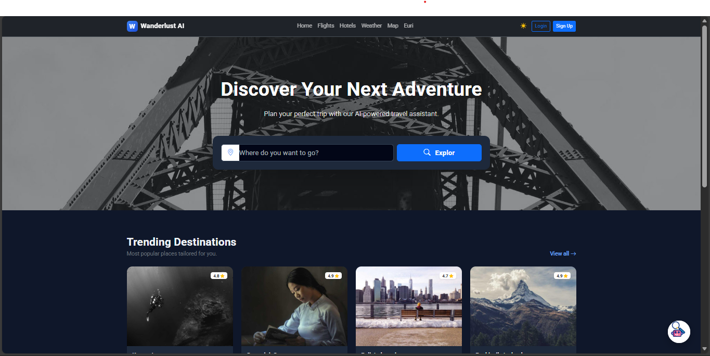

## 🤖 Euri AI Assistant
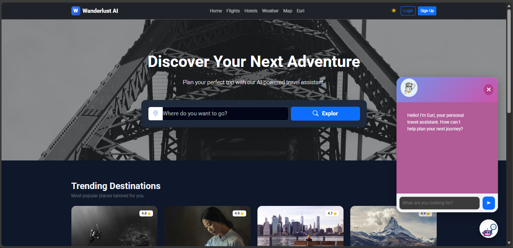

## 🏨 Hotel Search
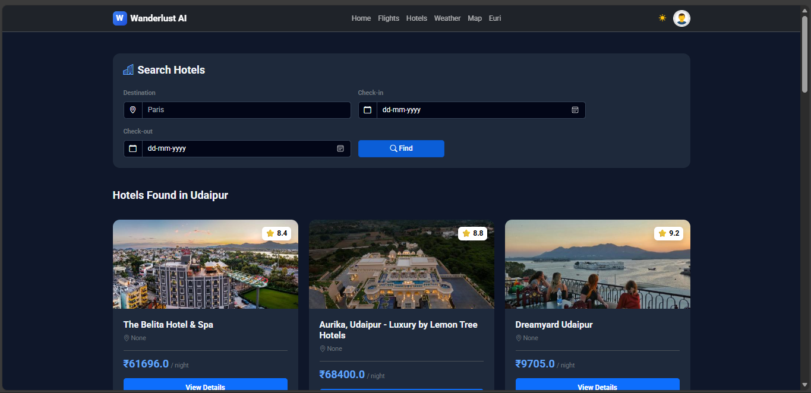

## 🛏️ Hotel Details
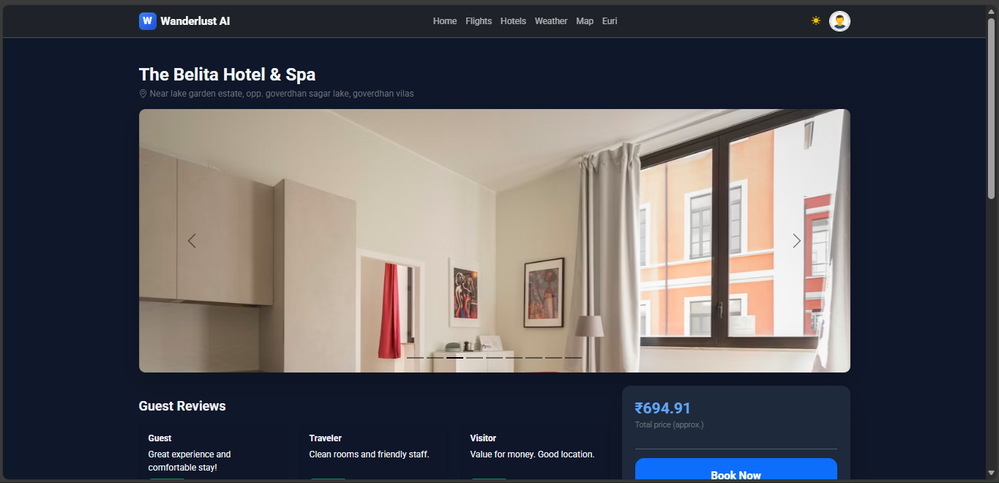

## ✈️ Flight Search
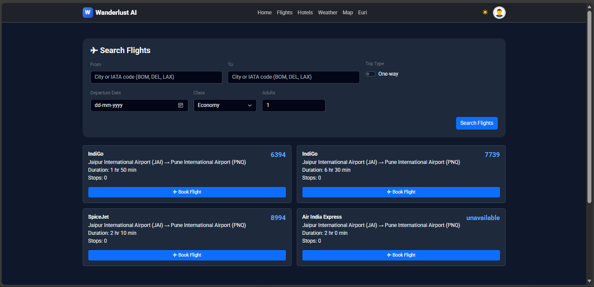

## 🌦️ Weather Page
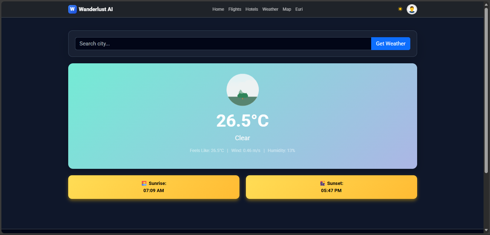

## 🗺️ Map Search
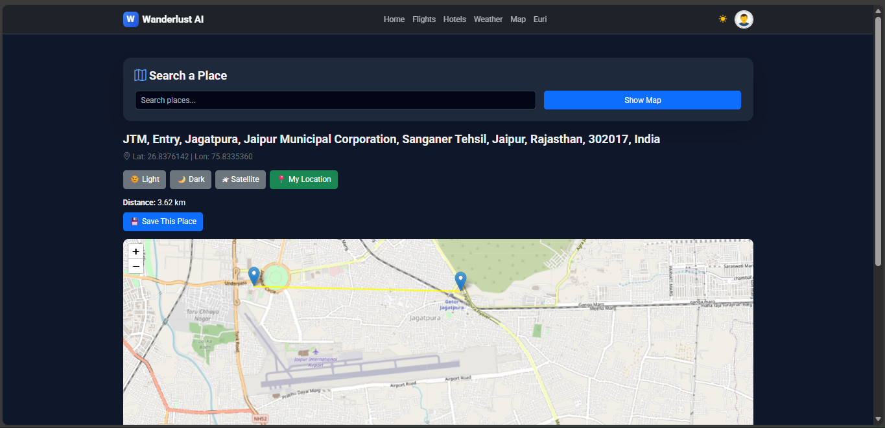

## 📊 User Dashboard
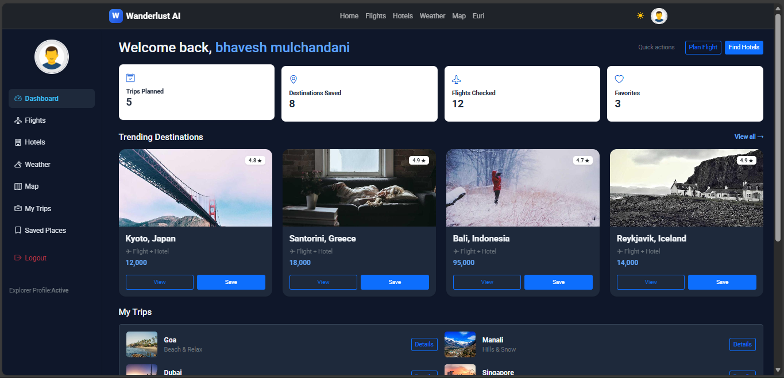

## 👥 User Management 
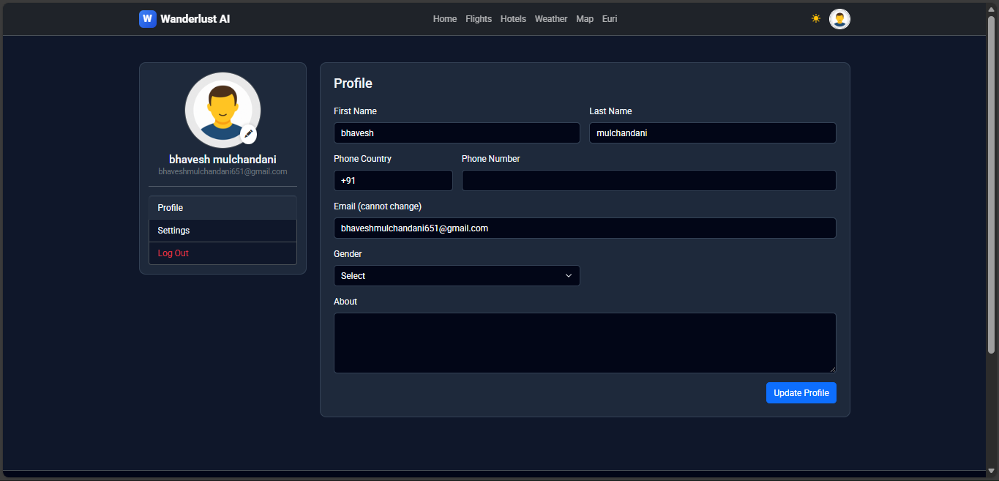

## 👤 Edit User 
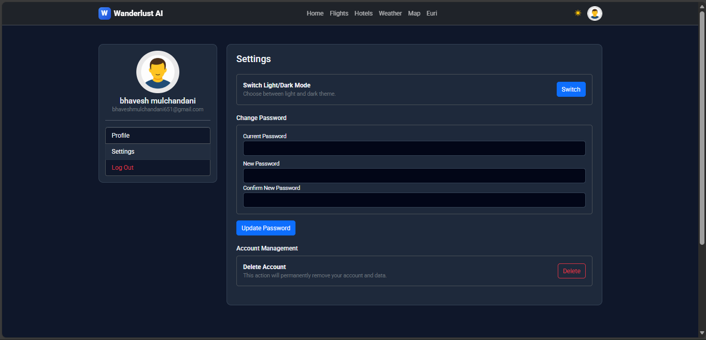

## 🤖 Euri Full Page
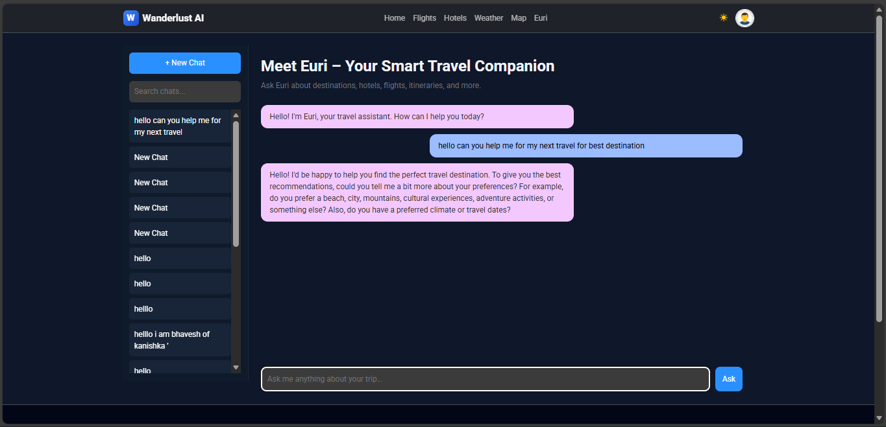

## 👤 Admin Panel
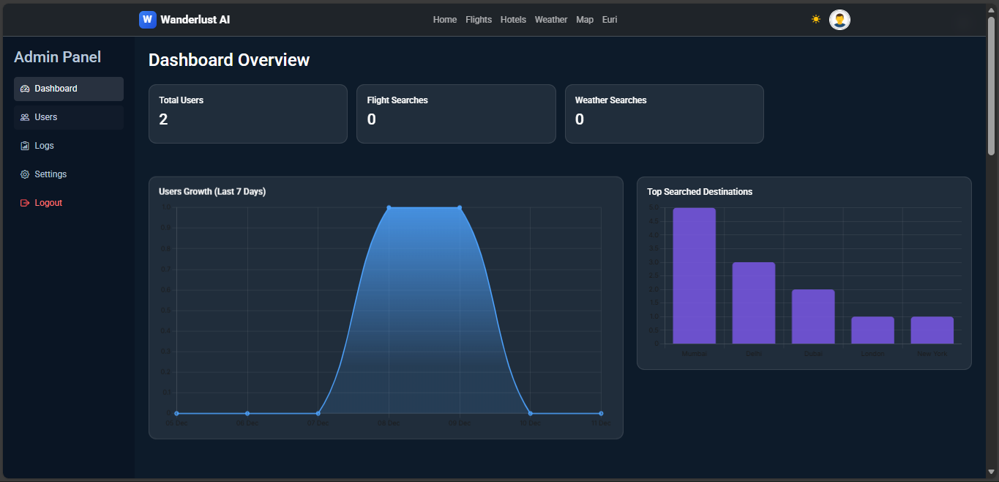

⚙️ Installation & Setup – Wanderlust AI

Follow these steps to set up the project smoothly on Windows, macOS, or Linux.

1️⃣ Clone the Repository

git clone https://github.com/Bhavesh950/wanderlust-ai.git
cd wanderlust-ai

2️⃣ (Optional but Recommended) Create Virtual Environment

This keeps your dependencies clean and avoids conflicts.

Windows:

- python -m venv venv
- venv\Scripts\activate

Mac / Linux:

- python3 -m venv venv
- source venv/bin/activate

3️⃣ Install Dependencies

pip install -r requirements.txt

🔑 4️⃣ Get Your API Keys (Required)

Sign up and get API keys from the following services:

| Feature                              | Provider                     | API Signup Link                                                                                             | Key Required?    |
| ------------------------------------ | ---------------------------- | ----------------------------------------------------------------------------------------------------------- | ---------------- |
| **AI Travel Assistant (Euri)** | Euron AI                     | [https://dashboard.euron.one](https://www.euron.one/euri)                                                      | ✔ Yes           |
| **Hotels Search API**          | Booking.com via RapidAPI     | [https://rapidapi.com/apidojo/api/booking](https://rapidapi.com/ntd119/api/booking-com18)                      | ✔ Yes           |
| **Flight Search API**          | Google Flights via RapidAPI  | [https://rapidapi.com/apidojo/api/google-flights-search](https://rapidapi.com/DataCrawler/api/google-flights2) | ✔ Yes           |
| **Airport Autocomplete**       | SearchAirport API (RapidAPI) | [https://rapidapi.com/Active-api/api/airport-info](https://rapidapi.com/Active-api/api/airport-info)           | ✔ Yes           |
| **Weather Forecast API**       | OpenWeather                  | [https://openweathermap.org/api](https://openweathermap.org/api)                                               | ✔ Yes           |
| **Destination Images**         | Unsplash                     | [https://unsplash.com/developers](https://unsplash.com/developers)                                             | ✔ Yes           |
| **Destination Description**    | **Wikipedia REST API** | [https://www.mediawiki.org/wiki/API:REST_API](https://www.mediawiki.org/wiki/API:REST_API)                     | ❌ No key needed |
| **Map Search**                 | Nominatim (OpenStreetMap)    | [https://nominatim.org](https://nominatim.org)                                                                 | ❌ No key needed |

🔐 5️⃣ Configure API Keys
✔ Recommended (If you CAN create .env)

Create a file named:

.env

Inside it, paste:

EURON_API_KEY=your_key_here
BOOKING_API_KEY=your_key_here
GOOGLE_FLIGHTS_KEY=your_key_here
UNSPLASH_ACCESS_KEY=your_key_here
WEATHER_API_KEY=your_key_here

❗ If you CANNOT create .env (Windows sometimes blocks it)
Use this temporary method:

Open app.py
Find:

- WEATHER_API_KEY
- UNSPLASH_ACCESS_KEY
- GOOGLE_FLIGHTS_KEY
- BOOKING_API_KEY
- EURON_API_KEY

Replace with your actual API keys (not recommended for production).

🗄️ 6️⃣ Setup MySQL Database

Open MySQL terminal or use phpMyAdmin / MySQL Workbench.

Run the FULL SQL file you already have:

Option A — Import the full database.sql file

SOURCE /path/to/database.sql;

Option B — Paste the SQL manually

7️⃣ Your database.sql will create these tables:

| Table Name                 | Purpose                            |
| -------------------------- | ---------------------------------- |
| **user**             | User accounts, profile, admin flag |
| **saved_trips**      | User saved destinations/trips      |
| **admin_logs**       | Track admin actions                |
| **user_analytics**   | Device, browser, IP logs           |
| **flight_searches**  | Track flight search stats          |
| **weather_searches** | Track weather searches             |
| **conversations**    | AI chat sessions                   |
| **messages**         | AI chat messages                   |

Your SQL file also includes the admin creation cheat:

To make yourself admin:

UPDATE user
SET is_admin = 1
WHERE email = 'bhaveshmulchandani651@gmail.com';

🎉 That’s it — database is complete.

▶️ 7️⃣ Run the Flask Server
python app.py

Open in browser:

👉 http://127.0.0.1:5000

🎉 Setup Complete — Start Exploring Wanderlust AI

- You now have:
- Full AI travel assistant
- Live hotels & flights
- Weather, maps, trending destinations
- Account system + saved trips
- Admin dashboard
- Chat history system
